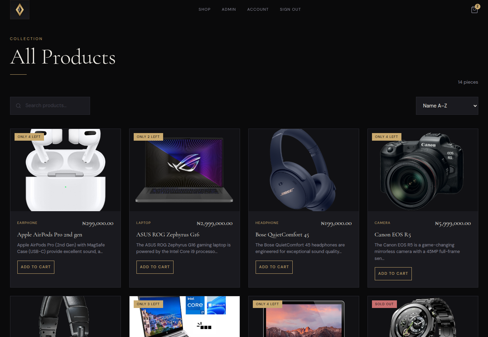
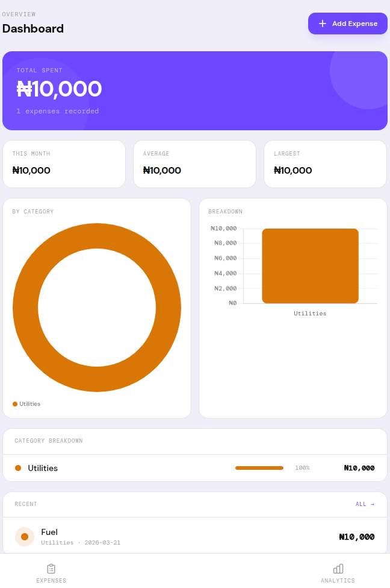

# Digital Architect — Portfolio 🚀

[](https://kit.svelte.dev)
[](https://svelte.dev)
[](https://tailwindcss.com)

A modern, responsive backend engineer's portfolio built with **SvelteKit 2**, **Svelte 5 runes**, and **Tailwind CSS v4**. Stunning bento-grid layouts, interactive terminal hero, projects gallery, skills toolbox, print-optimized resume, and server-validated contact form.

## Features ✨

- **Hero Terminal:** Interactive command-line intro with typewriter effect.
- **Bento Grids:** Asymmetric, responsive layouts for projects & skills.
- **Projects Gallery:** Live screenshots (Ecommerce, Expense Tracker).
- **Printable Resume:** CSS-optimized + [Lucky Samuel PDF](static/Lucky_Samuel_Resume.pdf).
- **Contact API:** Server-side validation, Resend/SendGrid ready (spam-resistant).
- **Dark Theme:** Synthetix Mono design system, fully mobile-responsive.

## Tech Stack

[](https://vitejs.dev)
[](https://developer.mozilla.org/en-US/docs/Web/JavaScript)

- [SvelteKit 2.50+](https://kit.svelte.dev/docs) + [Svelte 5 runes](https://svelte.dev/docs/svelte/v5-migration-guide)
- [Tailwind CSS 4](https://tailwindcss.com/docs/installation/using-vite) (@tailwindcss/vite)
- Vite 7
- Vanilla JS (no TS for speed/simplicity)

## Pages

| Route               | Description                       |
| ------------------- | --------------------------------- |
| 🏠 \`/\`            | Hero with terminal + bento home   |
| 💻 \`/projects\`    | Asymmetric projects bento gallery |
| 👤 \`/about\`       | Skills toolbox & bio              |
| 📄 \`/resume\`      | Print-friendly resume viewer      |
| ✉️ \`/contact\`     | API-wired contact form            |
| ⚙️ \`/api/contact\` | Server POST endpoint              |

## Screenshots 📸





## Getting Started

**Reqs:** Node.js 20+

```bash
git clone <repo> . && npm i
npm run dev  # http://localhost:5173
npm run build && npm run preview
```

## Project Structure

```bash
portfolio/
├── src/routes/     # +page.svelte, projects/, about/, etc.
├── src/components/ # Navbar, Home, Marquee, etc.
├── src/app.css     # Tailwind @theme
├── static/         # logos, screenshots, resume.pdf
├── svelte.config.js
├── package.json
└── README.md
```

## Contact Form 📧

Form → `POST /api/contact/+server.js` (full validation). Add Resend:

```bash
npm i resend
echo RESEND_API_KEY=... >> .env
```

In `+server.js`: uncomment & `import {RESEND_API_KEY} from '$env/static/private'`

## Deployment 🚀

```bash
# Vercel/Netlify (auto-adapter)
npm i -g vercel && vercel

# Node: vite build → node build/index.js
```

## Tailwind v4 🎨

CSS vars in `src/app.css` @theme. **Synthetix Mono**: Deep Sea dark, Space Grotesk + JetBrains Mono.

[](https://lbesson.mit-license.org/)

**⭐ Star / Fork for SvelteKit inspo!** By Lucky Samuel (@github.com/alchemistlowkey).
